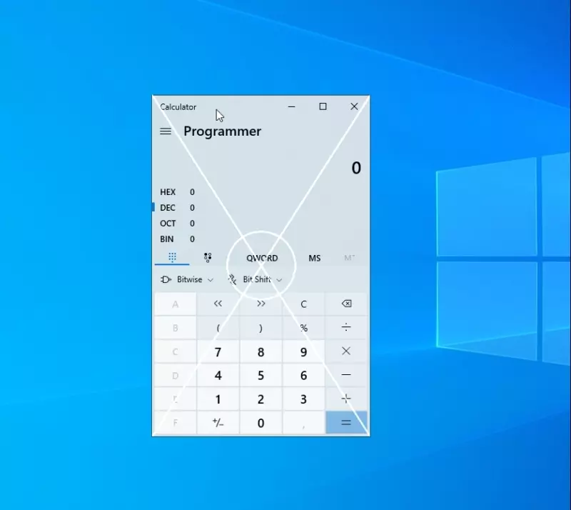
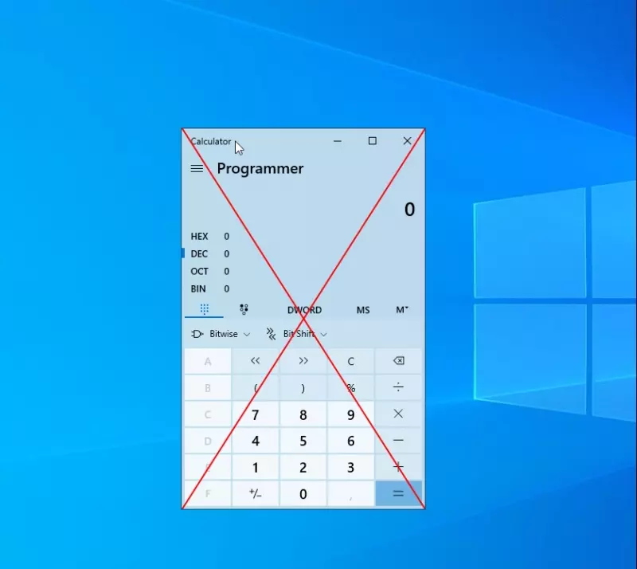

# OverlayApplication
 
## Description

External overlay window that is used to render stuff on top of other window

It's a common technique in game hacking 👨‍💻

## Example usage

```cpp
void OnTick(OverlayApp* overlay)
{
    // draw stuff if target window exists
    if (overlay->IsTargetValid())
    {
        auto width = overlay->GetWidth();
        auto height = overlay->GetHeight();
        
        overlay->Draw()->Line(0, 0, width, height);
        overlay->Draw()->Line(width, 0, 0, height);
        overlay->Draw()->Circle(width * 0.5f, height * 0.5f, 100);
    }
    
    // keyboard events also goes here
    if (GetAsyncKeyState(VK_NUMPAD5) & 1)
    {
        // do smth else, e.g., toggle bool variable
    }
}

void main()
{
    // pass name of the target window
    OverlayApp* overlay = new OverlayApp(L"Calculator");
    
    // construct window
    overlay->Create();
    
    // register callback
    overlay->AddCallback(OnTick);
    
    // endless loop
    overlay->Run();
}
```

## Showcase

<table>
  <tr>
    <td>
      
    </td>
  </tr>
  <tr>
    <td>
      
    </td>
  </tr>
</table>

## Credits

- [CasualGamer's video](https://www.youtube.com/watch?v=BIZyxja3Qls)
